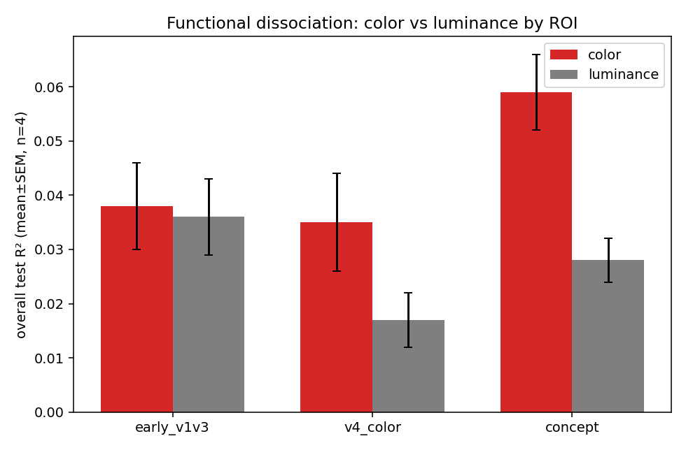
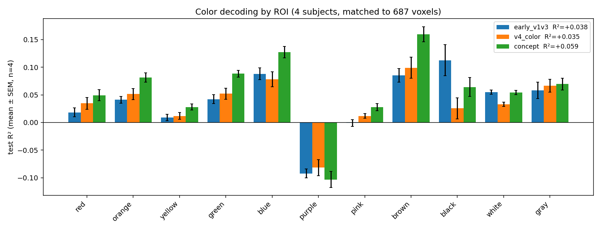

# brain2vision-nsd

> **New here?** Read the write-up first: **[`REPORT.md`](REPORT.md)** — the
> question, the analysis, and the findings (with figures). This README is the
> how-to-run guide.

Decoding perceived **color and luminance** from human visual cortex using 7T
fMRI from the **Natural Scenes Dataset (NSD)** — plus the ROI-selective loading,
CLIP / color / bounding-box target tooling behind it.

Built on the MindEye2 preprocessed NSD release (`pscotti/mindeyev2`) with a path
to raw NSD for fine-grained ROIs. Code is MIT-licensed; **the data is not** —
see [`DATA_TERMS.md`](DATA_TERMS.md).

## Findings

Full write-up with methods and figures: **[`REPORT.md`](REPORT.md)**.

Short version — a replicated (n=4 subjects), confound-controlled functional
dissociation in how visual cortex represents color vs brightness:



- Color decodes above chance everywhere; controlling for regularization **and**
  voxel count, **higher visual cortex decodes color best** (it's bound to object/
  scene identity).
- **Early visual cortex (V1–V3)** is the only region that decodes **luminance** as
  well as color — it owns the dark/bright end.
- **V4** shows no special advantage for *raw pixel* color, consistent with its
  role in *perceptual* color rather than low-level color.

Getting there meant removing three confounds in turn — fixed regularization,
then ROI voxel count, then single-subject noise — plus a data-alignment fix. The
report walks through each, because which comparison you run changes the answer.

## Install

```bash
git clone https://github.com/linduine/brain2vision-nsd-color
cd brain2vision-nsd-color
python -m venv .venv && source .venv/bin/activate
pip install -e ".[color]"     # core + color experiment deps
# other extras: ".[clip]"  ".[rawnsd]"  ".[all]"
```

## Get the data

By downloading you accept the NSD and COCO terms (see `DATA_TERMS.md`).

```bash
python download_data.py --subjects 1          # small files + one subject's betas
# later: python download_data.py --subjects 1 2 5 7
# optional images for targets: add --images  (~22 GB)
```

## Quickstart: reproduce the color/luminance comparison

```bash
# 1) inspect available ROIs (optional)
python -m brain2vision.inspect_rois

# 2) build the targets from the images
python -m brain2vision.color_targets     --images data/coco_images_224_float16.hdf5 --out data/color_targets.npy
python -m brain2vision.luminance_targets --images data/coco_images_224_float16.hdf5 --out data/luminance_targets.npy

# 3) single-subject decode (default ROI = V4; RidgeCV-tuned)
python -m brain2vision.color_decode --subj 1 --color-targets data/color_targets.npy

# 4) the real comparison: voxel-matched, across subjects (color, then luminance)
python -m brain2vision.replicate_subjects --subjects 1 2 5 7 \
    --target data/color_targets.npy --out roi_color_4subj.png
python -m brain2vision.replicate_subjects --subjects 1 2 5 7 \
    --target data/luminance_targets.npy --labels L0,L1,L2,L3,L4,L5,L6,L7,L8,L9,L10 \
    --out roi_luminance_4subj.png
```

Result (4 subjects, matched to 687 voxels — see [`REPORT.md`](REPORT.md)):



`compare_rois` runs the matched comparison for a single subject, and
`color_shared_subject` is an alternative pooling model (per-subject projection →
shared readout). See [`docs/methods.md`](docs/methods.md) for all options.

## Other targets

```bash
# CLIP embedding targets (decoder targets for reconstruction work)
python -m brain2vision.clip_targets --images data/coco_images_224_float16.hdf5 \
    --out data/clip_vitL_img.npy                      # ViT-L/14 (light)
#   add: --model ViT-bigG-14 --pretrained laion2b_s39b_b160k   # MindEye2 target

# COCO bounding boxes in the NSD 425x425 stimulus frame
python -m brain2vision.bboxes --out data/nsd_bboxes.json
python -m brain2vision.visualize --images data/coco_images_224_float16.hdf5 \
    --bboxes data/nsd_bboxes.json --nsd-id 3 --out check_3.png

# fine-grained ROIs (FFA, PPA, V1v, ...) from raw NSD
python -m brain2vision.raw_nsd --subj 1 --atlas floc-faces --regions FFA-1 FFA-2
```

## Repo layout

```
brain2vision-nsd/
├── brain2vision/          # the package
│   ├── roi.py             # ROI-selective betas (3 named sets)
│   ├── inspect_rois.py    # list ROI names per subject
│   ├── raw_nsd.py         # fine-grained ROIs from raw NSD
│   ├── clip_targets.py    # CLIP image/text embeddings
│   ├── bboxes.py          # COCO boxes -> NSD frame
│   ├── visualize.py       # draw boxes on a stimulus image
│   ├── color_targets.py   # 11-way color distribution per image
│   ├── luminance_targets.py # 11-bin brightness distribution per image
│   ├── color_decode.py    # decoder + eval (RidgeCV, any target)
│   ├── compare_rois.py    # voxel-matched ROI comparison + plot
│   ├── replicate_subjects.py # matched comparison across subjects
│   └── color_shared_subject.py  # shared-subject V4 model
├── download_data.py       # fetch data into ./data (respects terms)
├── smoke_test.py          # offline install check (no data needed)
├── REPORT.md              # the write-up: methods, findings, figures
├── figures/               # result figures
├── data/                  # gitignored; populated by download_data.py
├── docs/methods.md        # detailed methods, ROI structure, caveats
├── DATA_TERMS.md          # NSD + COCO terms
├── pyproject.toml         # install + optional dependency groups
└── LICENSE                # MIT (code only)
```

Full method notes, ROI structure, alignment caveats, and extension ideas are in
[`docs/methods.md`](docs/methods.md).

## Two things to verify on first run

1. **Bounding-box crop convention.** Boxes are transformed with NSD's `cropBox`
   assumed `(top, bottom, left, right)`. Run `brain2vision.visualize` and confirm
   boxes hug the objects before trusting at scale.
2. **Betas↔image alignment.** MindEye2 betas aren't in image order; the color
   decoder recovers each trial's image id / betas row from the webdataset
   `behav` arrays (default columns `0` and `5`). The script prints the id/row
   ranges — check them once.

## Citation

If you use this, please cite NSD (Allen et al., 2022), COCO (Lin et al., 2014),
and MindEye2 (Scotti et al., 2024).
