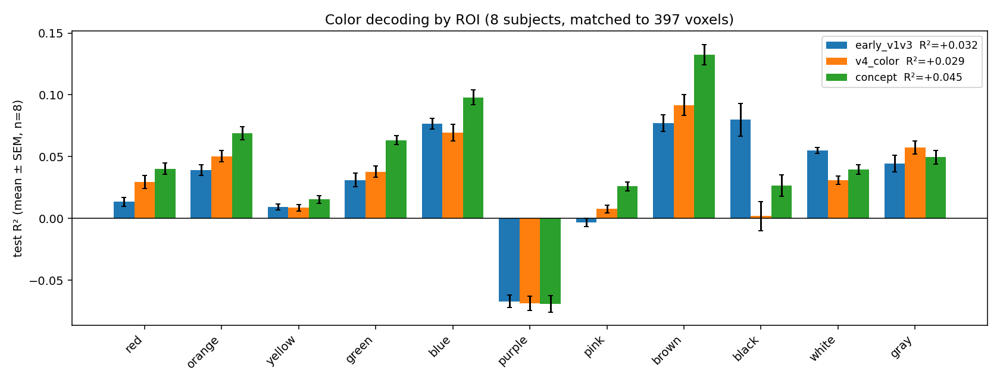

# brain2vision-nsd

> **New here?** Read the write-up first: **[the project site](https://linduine.github.io/brain2vision-nsd-color/)**, the
> question, the analysis, and the findings (with figures). This README is the
> how-to-run guide.

Decoding perceived **color and luminance** from human visual cortex using 7T
fMRI from the **Natural Scenes Dataset (NSD)**, plus the ROI-selective loading,
CLIP / color / bounding-box target tooling behind it.

Built on the MindEye2 preprocessed NSD release (`pscotti/mindeyev2`) with a path
to raw NSD for fine-grained ROIs. Code is MIT-licensed; **the data is not** 
see [`DATA_TERMS.md`](DATA_TERMS.md).

## Findings

Full write-up with methods and figures: **[the project site](https://linduine.github.io/brain2vision-nsd-color/)**.

Short version, a replicated (all 8 subjects), confound-controlled functional
dissociation in how visual cortex represents color vs brightness:


- Color decodes above chance everywhere; controlling for regularization **and**
  voxel count, **higher visual cortex decodes color best**, and that advantage is
  largely predictable from the scene content the region represents.
- **Early visual cortex (V1–V3)** is the only region that decodes **luminance** as
  well as color, it owns the dark/bright end.
- **V4** shows no advantage on either target; in these data it sits intermediate
  between early and higher visual cortex.

Getting there meant removing three confounds in turn, fixed regularization,
then ROI voxel count, then single-subject noise, plus a data-alignment fix. The
report walks through each, because which comparison you run changes the answer.

## Update: confound-controlled follow-up (preprint in preparation)

The central open question, *is higher visual cortex's color advantage chromatic
or content-predictable?*, has now been tested directly, with a battery of controls.
**The color advantage of higher visual cortex is largely content-predictable.**

- **Object-identity residualization.** Removing the variance explained by object
  presence (80 COCO categories) collapses color decoding in every region, but
  *significantly more* in higher visual cortex (interaction *p* = 0.008), and the
  regional ordering **reverses**, early cortex then carries the most
  content-unpredicted color. Holds for a physical *and* a perceptual color target.
- **Attention.** Color decoding is not foreground-specific; it follows retinotopy.
- **Decoder-agnostic.** Ridge, elastic-net, linear SVM, RBF-kernel and a regularized
  MLP all reproduce the dissociation; no nonlinear decoder beats a linear one.
- **Reliability.** Per-participant region profiles reproduce across image-disjoint
  data halves (*r* ≈ 0.9; ordering reproduces in 8/8).
- **Signal quality.** Higher visual cortex has the *lowest* noise-ceiling SNR yet the
  *highest* color decoding, data quality works against the effect, not for it.
- **Isoluminant control.** No detectable hue decoding without scene structure, though
  this control is low-powered and is reported with that caveat.

New modules: `reliability` (split-half), `ncsnr_quality` (signal quality),
`fg_bg_color_targets` (attention), `synthetic_decode` (isoluminant),
`perceptual_color_targets` (color naming).

A preprint, *"Is color in the human visual cortex chromatic or content-predictable? A confound-controlled decoding study of the Natural Scenes Dataset"*, is in
preparation.

> **Verifying the code?** Run `python test_analysis.py` (26 checks: plant a known signal,
> confirm the code recovers it; plant a known null, confirm it doesn't) and
> `python test_plumbing.py` (21 checks on the actual derived targets: id alignment,
> fg/bg partition, residualization, split integrity).
>
> **Reproducing the paper?** [`PROVENANCE.md`](PROVENANCE.md) maps every reported number to
> the exact `*_summary.npy` file and the command that produced it, and flags which of the
> similarly-named result files are superseded. `results_manifest.json` is the machine-readable
> version.

## Install

```bash
git clone https://github.com/linduine/brain2vision-nsd-color
cd brain2vision-nsd-color
python -m venv .venv && source .venv/bin/activate
pip install -e ".[color]"     # core + color experiment deps
# other extras: ".[clip]"  ".[rawnsd]"  ".[all]"
```

## Get the data

By downloading you accept the NSD and COCO terms (see `DATA_TERMS.md`).

```bash
python download_data.py --subjects 1          # small files + one subject's betas
# later: python download_data.py --subjects 1 2 3 4 5 6 7 8
# optional images for targets: add --images  (~22 GB)
```

## Quickstart: reproduce the color/luminance comparison

```bash
# 1) inspect available ROIs (optional)
python -m brain2vision.inspect_rois

# 2) build the targets from the images
python -m brain2vision.color_targets     --images data/coco_images_224_float16.hdf5 --out data/color_targets.npy
python -m brain2vision.luminance_targets --images data/coco_images_224_float16.hdf5 --out data/luminance_targets.npy

# 3) single-subject decode (default ROI = V4; RidgeCV-tuned)
python -m brain2vision.color_decode --subj 1 --color-targets data/color_targets.npy

# 4) the real comparison: voxel-matched, across all 8 subjects (color, then luminance)
python -m brain2vision.replicate_subjects --subjects 1 2 3 4 5 6 7 8 \
    --target data/color_targets.npy --out roi_color_8subj.png
python -m brain2vision.replicate_subjects --subjects 1 2 3 4 5 6 7 8 \
    --target data/luminance_targets.npy --labels L0,L1,L2,L3,L4,L5,L6,L7,L8,L9,L10 \
    --out roi_luminance_8subj.png
```

Result (8 subjects, matched to 397 voxels, see [the project site](https://linduine.github.io/brain2vision-nsd-color/)):



`compare_rois` runs the matched comparison for a single subject, and
`color_shared_subject` is an alternative pooling model (per-subject projection →
shared readout). See [`docs/methods.md`](docs/methods.md) for all options.

## Other targets

```bash
# CLIP embedding targets (decoder targets for reconstruction work)
python -m brain2vision.clip_targets --images data/coco_images_224_float16.hdf5 \
    --out data/clip_vitL_img.npy                      # ViT-L/14 (light)
#   add: --model ViT-bigG-14 --pretrained laion2b_s39b_b160k   # MindEye2 target

# COCO bounding boxes in the NSD 425x425 stimulus frame
python -m brain2vision.bboxes --out data/nsd_bboxes.json
python -m brain2vision.visualize --images data/coco_images_224_float16.hdf5 \
    --bboxes data/nsd_bboxes.json --nsd-id 3 --out check_3.png

# fine-grained ROIs (FFA, PPA, V1v, ...) from raw NSD
python -m brain2vision.raw_nsd --subj 1 --atlas floc-faces --regions FFA-1 FFA-2
```

## Repo layout

```
brain2vision-nsd/
├── brain2vision/          # the package
│   ├── roi.py             # ROI-selective betas (3 named sets)
│   ├── inspect_rois.py    # list ROI names per subject
│   ├── raw_nsd.py         # fine-grained ROIs from raw NSD
│   ├── clip_targets.py    # CLIP image/text embeddings
│   ├── bboxes.py          # COCO boxes -> NSD frame
│   ├── visualize.py       # draw boxes on a stimulus image
│   ├── color_targets.py   # 11-way color distribution per image
│   ├── luminance_targets.py # 11-bin brightness distribution per image
│   ├── color_decode.py    # decoder + eval (RidgeCV, any target)
│   ├── compare_rois.py    # voxel-matched ROI comparison + plot
│   ├── replicate_subjects.py # matched comparison across subjects
│   └── color_shared_subject.py  # shared-subject V4 model
├── download_data.py       # fetch data into ./data (respects terms)
├── smoke_test.py          # offline install check (no data needed)
├── figures/               # result figures
├── data/                  # gitignored; populated by download_data.py
├── docs/methods.md        # detailed methods, ROI structure, caveats
├── DATA_TERMS.md          # NSD + COCO terms
├── pyproject.toml         # install + optional dependency groups
└── LICENSE                # MIT (code only)
```

Full method notes, ROI structure, alignment caveats, and extension ideas are in
[`docs/methods.md`](docs/methods.md).

## Citation

If you use this, please cite NSD (Allen et al., 2022), COCO (Lin et al., 2014),
and MindEye2 (Scotti et al., 2024).
