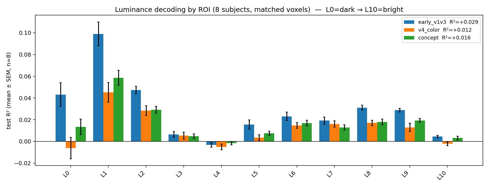

# Decoding color and luminance from human visual cortex

*A small brain-to-vision study on the Natural Scenes Dataset (NSD).*

## TL;DR

Using 7T fMRI from the Natural Scenes Dataset, I asked a simple question — **which
parts of visual cortex let you read out the colors a person is looking at?** — and
found a clean, replicated functional dissociation:

- **Color** is decodable above chance from all of visual cortex. Once you control
  for regularization *and* the number of voxels, **higher visual cortex decodes
  color best**, because color is bound to object and scene identity.
- **Early visual cortex (V1–V3)** is the only region that decodes **luminance
  (brightness)** as well as it decodes color — it owns the low-level, dark/bright
  end of the signal.
- **V4** — despite its textbook reputation as "the color area" — shows no special
  advantage for *raw pixel* color, consistent with its actual role in
  *perceptual/constant* color rather than low-level color.

The most compact summary is one figure:


Higher visual cortex (`concept`) is strongly color-biased; early visual
(`early_v1v3`) is balanced across color and luminance; V4 is color-biased but
weak on both raw measures. All effects replicate across four subjects.

## Background

NSD is a large 7T fMRI dataset in which 8 subjects each viewed ~9–10k natural
images (from COCO) over 30–40 scan sessions. It's the standard testbed for
"brain-to-vision" decoding. I worked from the preprocessed MindEye2 release
(`pscotti/mindeyev2`), which provides each subject's single-trial betas flattened
to the `nsdgeneral` visual ROI (~13–16k voxels), paired with the seen images.

Within `nsdgeneral`, the release labels three functional pools per subject, which
I use as my ROIs:

| ROI key | region | voxels (subj 1) |
|---|---|---|
| `early_v1v3` | early visual areas V1–V3 | 3,970 |
| `v4_color` | area V4 | 687 |
| `concept` | all higher visual cortex (`higher_vis`) | 11,067 |

**Targets.** For each image I computed an interpretable 11-way *color* histogram
(fraction of pixels in each basic color: red, orange, yellow, green, blue,
purple, pink, brown, black, white, gray) and, later, an 11-bin *luminance*
histogram (fraction of pixels from dark to bright, using standard luma
weighting). The decoder predicts these soft distributions from voxel activity.

**Decoder.** Ridge regression from z-scored voxels to the target histogram. Test
set = the held-out shared-1000 images (never seen in training); train = the rest.
Metrics: overall R² (variance explained), per-target R², and dominant-bin top-1
accuracy (chance = 1/11 ≈ 0.091).

## The analysis, and the confounds I had to remove

The headline result only becomes trustworthy after removing three confounds. I'm
including the journey because *which* comparison you run changes the answer
entirely — and noticing that is most of the work.

**1. Fixed regularization is unfair to big ROIs.** My first pass used a single
ridge `alpha` for every ROI. Higher visual cortex (11k voxels) badly *overfit*
and scored **negative** test R² (−0.37), making it look like the worst region —
purely an artifact of under-regularization, not biology.

**2. Tuning `alpha` per ROI flips the result.** Switching to `RidgeCV` (leave-one-out
CV over a grid of alphas) let each ROI pick its own regularization. The chosen
alphas scaled with ROI size exactly as they should (V4 → 5.3k, early → 15k,
concept → 43k), all overfitting vanished, and now higher visual cortex looked
*best*. But that introduced a second confound...

**3. Bigger ROIs win just by having more voxels.** More voxels = more signal,
regardless of per-voxel selectivity. So I **matched voxel count**: subsample every
ROI to the smallest one's size (V4's 687), decode, and average over 10 random
draws. Only after this is the comparison about color information *per unit of
cortex*.

**4. Replication.** I repeated the matched analysis across the four subjects who
completed all 40 sessions (1, 2, 5, 7) and summarized as mean ± SEM.

**5. A luminance control.** The color results hinted that early visual's strength
was really *luminance* (it decoded "black" far better than any other region). So I
built a brightness target and decoded it the same way, as a direct test.

(One data-hygiene fix along the way: the alignment between betas and images is
stored in per-trial `behav` records, and my first reader accidentally also pulled
in each trial's *neighbor* records — 4× the data plus label padding — which
inflated and slightly leaked the estimates. Filtering to the current trial fixed
it.)

## Results

### Color, matched and replicated (n = 4)

| ROI | overall R² | top-1 |
|---|---|---|
| concept (higher visual) | **0.059 ± 0.007** | 0.256 ± 0.008 |
| early_v1v3 | 0.038 ± 0.008 | 0.258 ± 0.009 |
| v4_color | 0.035 ± 0.009 | 0.240 ± 0.009 |

All ROIs decode the dominant color at ~0.25–0.26 vs 0.091 chance (~2.8×). With
size and regularization controlled, **higher visual cortex decodes color best** —
a reliable gap across subjects.


The per-color pattern is the interesting part. Higher visual cortex leads on the
chromatic, object-bound colors (brown 0.16, blue 0.13, green 0.09, orange 0.08).
Early visual is the standout for **black** (0.113 vs V4's 0.026) and ties for
white — the luminance extremes. Rare colors (purple, pink) are unreliable
everywhere: too few training examples.

### Luminance: the dissociation (n = 4)

| ROI | overall luminance R² |
|---|---|
| early_v1v3 | **0.036 ± 0.007** |
| concept | 0.028 ± 0.004 |
| v4_color | 0.017 ± 0.005 |

For brightness the order **flips**: early visual leads and V4 drops to last
(early reliably beats V4). And within each region, the contrast is the real story:
higher visual and V4 are ~2× color-biased (they care about chromatic color far
more than brightness), while **early visual is balanced** across the two.



The luminance signal is concentrated in the **dark bins** (L0–L2), where early
visual dominates (L1 = 0.123, the single strongest luminance value anywhere) and
V4 is near zero (L0 = 0.011). This corroborates the "black" color result from an
independent target.

## Interpretation

The pattern maps cleanly onto known visual neuroscience:

- **Early visual cortex (V1–V3)** represents low-level, retinotopic image
  properties — luminance and local chromatic contrast — and decodes brightness and
  color about equally. Its edge in the dark/black regime is a luminance signature.
- **Higher visual cortex** decodes color best not because it is chromatically
  tuned per se, but because color is correlated with *what's in the scene* (sky is
  blue, foliage green, indoor scenes brown/gray), which higher visual cortex
  encodes. It is strongly biased toward chromatic over luminance information.
- **V4** is chromatically biased (color > luminance, like higher visual) but weak
  on raw pixel statistics. This is consistent with V4's role in *perceptual/
  constant* color — seeing a stable surface color across changing illumination —
  rather than reading raw wavelength. My targets are raw-pixel color/luminance, so
  they don't play to V4's actual specialty.

## Caveats

- **Correlational.** "Decodable from region X" ≠ "represented or used by X."
- **Raw-pixel targets.** Color/luminance histograms of the stimulus don't capture
  *perceptual* color (constancy, categories), which is likely where V4 would shine.
- **Single dataset, n = 4.** Error bars are across subjects for the group claims
  and across voxel draws for the matching; both are small, but this is one dataset.
- **Rare colors unreliable.** Purple/pink have too few examples; their negative R²
  is a scarcity artifact, not signal.
- **`concept` is a coarse pool.** `higher_vis` lumps all higher visual cortex; it
  does not separate face/place/body/word regions (that needs raw-NSD ROI masks,
  which this repo also supports).

## Reproduce

```bash
pip install -e ".[color]"
python download_data.py --subjects 1 2 5 7 --images
python -m brain2vision.color_targets --images data/coco_images_224_float16.hdf5 --out data/color_targets.npy
python -m brain2vision.luminance_targets --images data/coco_images_224_float16.hdf5 --out data/luminance_targets.npy
# color, matched + replicated across subjects
python -m brain2vision.replicate_subjects --subjects 1 2 5 7 --target data/color_targets.npy --out roi_color_4subj.png
# luminance, same pipeline
python -m brain2vision.replicate_subjects --subjects 1 2 5 7 --target data/luminance_targets.npy \
    --labels L0,L1,L2,L3,L4,L5,L6,L7,L8,L9,L10 --out roi_luminance_4subj.png
```

## Data & credit

Code is MIT-licensed; the data is not. NSD and COCO have their own terms — see
`DATA_TERMS.md`. Please cite NSD (Allen et al., 2022), COCO (Lin et al., 2014),
and MindEye2 (Scotti et al., 2024).
