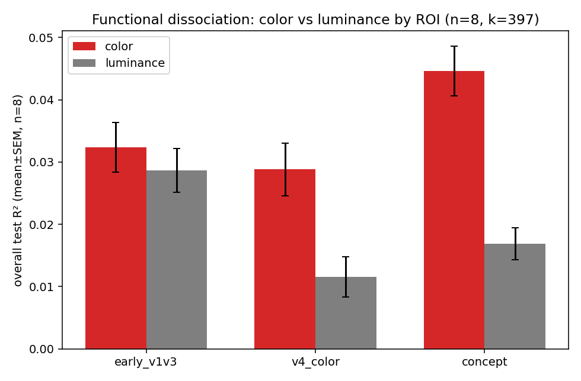
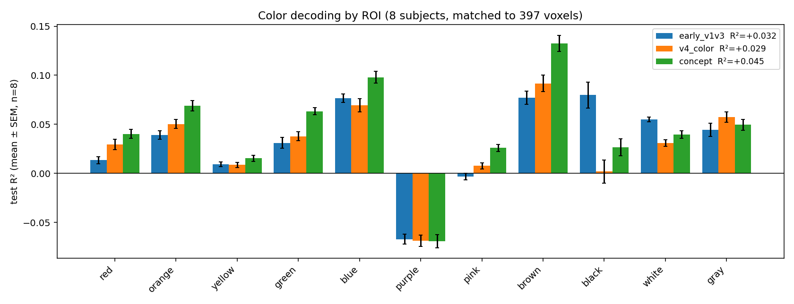
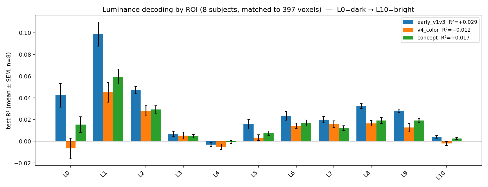

# Decoding color and luminance from human visual cortex

*A small brain-to-vision study on the Natural Scenes Dataset (NSD).*

## TL;DR

Using 7T fMRI from the Natural Scenes Dataset, I asked a simple question — **which
parts of visual cortex let you read out the colors a person is looking at?** — and
found a clean, replicated functional dissociation:

- **Color** is decodable above chance from all of visual cortex. Once you control
  for regularization *and* the number of voxels, **higher visual cortex decodes
  color best**, because color is bound to object and scene identity.
- **Early visual cortex (V1–V3)** is the only region that decodes **luminance
  (brightness)** as well as it decodes color, and is strongest at the low-level,
  dark/bright end.
- **V4** — despite its textbook reputation as "the color area" — shows no special
  advantage for *raw pixel* color, consistent with its actual role in
  *perceptual/constant* color rather than low-level color.

The most compact summary is one figure:



Higher visual cortex (`concept`) is strongly color-biased; early visual
(`early_v1v3`) is balanced across color and luminance; V4 is color-biased but
weak on both raw measures. All effects replicate across **all 8 NSD subjects**,
and both directions of the dissociation are statistically reliable (the SEM bars
don't overlap where it counts).

## Motivation & hypotheses

Area V4 has long been described as the brain's "colour centre" — from Zeki's
macaque single-unit recordings (Zeki, 1973), to human fMRI localizers that
isolated a ventral-occipital colour region (hV4 / V4α; Bartels & Zeki, 2000),
to cerebral achromatopsia, where
ventral-occipital lesions abolish colour perception while sparing form and motion
(Zeki, 1990). Modern work is more nuanced — colour is processed across a network
and V4's role is closer to *perceptual/constant* colour than raw wavelength (Roe
et al., 2012) — but "V4 = colour" is the textbook default. That set up two
questions, plus a control added along the way:

- **H1 — Is V4 special for colour?** If so, V4 should decode the image's colour
  content better than other ROIs, even under a fair comparison (matched voxels +
  regularization).
- **H2 — Early vs. higher visual cortex for colour?** Which carries more
  decodable colour: early visual (V1–V3, colour-opponent from the first cortical
  stage) or higher "concept" cortex (where colour co-varies with object/scene
  identity)?
- **H3 — Is early visual's colour signal really luminance?** Early visual decoded
  black/white far better than any chromatic colour; if that is brightness
  sensitivity, it should also decode an independent luminance target best.

**What we found:** H1 — *not supported* (V4 has no raw-colour advantage,
consistent with a perceptual-colour role); H2 — *higher visual cortex wins*, but
via colour↔identity correlation, not per-voxel chromatic tuning; H3 — *supported*
(early visual decodes brightness best and is strongest at the dark end). The rest
of this document is the evidence, and the confounds removed to trust it.

## Background

NSD is a large 7T fMRI dataset in which 8 subjects each viewed ~9–10k natural
images (from COCO) over 30–40 scan sessions. It's the standard testbed for
"brain-to-vision" decoding. I worked from the preprocessed MindEye2 release
(`pscotti/mindeyev2`), which provides each subject's single-trial betas flattened
to the `nsdgeneral` visual ROI (~13–16k voxels), paired with the seen images.

Within `nsdgeneral`, the release labels three functional pools per subject, which
I use as my ROIs:

| ROI key | region | voxels (subj 1) |
|---|---|---|
| `early_v1v3` | early visual areas V1–V3 | 3,970 |
| `v4_color` | area V4 | 687 |
| `concept` | all higher visual cortex (`higher_vis`) | 11,067 |

**Targets.** For each image I computed an interpretable 11-way *color* histogram
(fraction of pixels in each basic color: red, orange, yellow, green, blue,
purple, pink, brown, black, white, gray) and, later, an 11-bin *luminance*
histogram (fraction of pixels from dark to bright, using standard luma
weighting). The decoder predicts these soft distributions from voxel activity.

**Decoder.** Ridge regression from z-scored voxels to the target histogram. Test
set = the held-out shared-1000 images (never seen in training); train = the rest.
Metrics: overall R² (variance explained), per-target R², and dominant-bin top-1
accuracy (chance = 1/11 ≈ 0.091).

## The analysis, and the confounds I had to remove

The headline result only becomes trustworthy after removing three confounds. I'm
including the journey because *which* comparison you run changes the answer
entirely — and noticing that is most of the work.

**1. Fixed regularization is unfair to big ROIs.** My first pass used a single
ridge `alpha` for every ROI. Higher visual cortex (11k voxels) badly *overfit*
and scored **negative** test R² (−0.37), making it look like the worst region —
purely an artifact of under-regularization, not biology.

**2. Tuning `alpha` per ROI flips the result.** Switching to `RidgeCV` (leave-one-out
CV over a grid of alphas) let each ROI pick its own regularization. The chosen
alphas scaled with ROI size exactly as they should (V4 → 5.3k, early → 15k,
concept → 43k), all overfitting vanished, and now higher visual cortex looked
*best*. But that introduced a second confound...

**3. Bigger ROIs win just by having more voxels.** More voxels = more signal,
regardless of per-voxel selectivity. So I **matched voxel count**: subsample every
ROI to the smallest V4 across subjects (397 voxels, set by subject 7 — V4 ranges
from 397 to 687 across the eight), decode, and average over repeated random draws
(25 by default). This makes the comparison about color information
*per unit of cortex*. The exact draw count matters little — the draw-to-draw
variability is far smaller than the across-subject SEM the error bars report, so
the draws just stabilize each subject's estimate.

**4. Replication.** I repeated the matched analysis across subjects — first the
four who completed all 40 sessions (1, 2, 5, 7), then all 8 (adding the
reduced-session subjects 3, 4, 6, 8) — and summarized as mean ± SEM. The pattern
held, and the added subjects tightened the error bars.

**5. A luminance control.** The color results hinted that early visual's strength
was really *luminance* (it decoded "black" far better than any other region). So I
built a brightness target and decoded it the same way, as a direct test.

(One data-hygiene fix along the way: the alignment between betas and images is
stored in per-trial `behav` records, and my first reader accidentally also pulled
in each trial's *neighbor* records — 4× the data plus label padding — which
inflated and slightly leaked the estimates. Filtering to the current trial fixed
it.)

## Results

All numbers below are across **all 8 NSD subjects** (mean ± SEM), each ROI
subsampled to 397 voxels (the smallest V4 across subjects) with alpha tuned per
fit. Adding the four
reduced-session subjects (3, 4, 6, 8) to the four complete ones lowers the
absolute R² a little and tightens the error bars — the pattern is unchanged.

### Color, matched and replicated (n = 8)

| ROI | overall R² | top-1 |
|---|---|---|
| concept (higher visual) | **0.045 ± 0.004** | 0.239 ± 0.004 |
| early_v1v3 | 0.032 ± 0.004 | 0.246 ± 0.004 |
| v4_color | 0.029 ± 0.004 | 0.234 ± 0.004 |

All ROIs decode the dominant color well above the 0.091 chance baseline. With
size and regularization controlled, **higher visual cortex decodes color best** —
a gap that is reliable across the full cohort (0.045 vs 0.032, ~2.3× the combined
SEM).



Breaking it down by color: higher visual cortex leads on the
chromatic, object-bound colors (brown 0.13, blue 0.10, orange 0.07, green 0.06).
Early visual is the standout for **black** (0.080 vs V4's 0.002 — essentially
zero) and leads on white too — the luminance extremes. Rare colors (purple, pink)
are unreliable everywhere: too few training examples.

### Luminance: the dissociation (n = 8)

| ROI | overall luminance R² |
|---|---|
| early_v1v3 | **0.029 ± 0.004** |
| concept | 0.017 ± 0.003 |
| v4_color | 0.012 ± 0.003 |

For brightness the order **flips**: early visual leads, V4 drops to last, and at
n = 8 early's lead over higher visual is reliable (0.029 vs 0.017, ~2.4× the
combined SEM — it was only marginal at n = 4). The within-region contrast is also
notable: higher visual and V4 are ~2× color-biased (better at chromatic color
than at brightness), while **early visual is balanced** across the two.



The luminance signal is concentrated in the **dark bins** (L0–L2), where early
visual dominates (L1 = 0.099, the single strongest luminance value anywhere) and
V4 is near zero or negative (L0 = −0.007). This corroborates the "black" color
result from an independent target.

## Interpretation

The pattern maps cleanly onto known visual neuroscience:

- **Early visual cortex (V1–V3)** represents low-level, retinotopic image
  properties — luminance and local chromatic contrast — and decodes brightness and
  color about equally. Its edge in the dark/black regime is a luminance signature.
- **Higher visual cortex** decodes color best not because it is chromatically
  tuned per se, but because color is correlated with *what's in the scene* (sky is
  blue, foliage green, indoor scenes brown/gray), which higher visual cortex
  encodes. It is strongly biased toward chromatic over luminance information.
- **V4** is chromatically biased (color > luminance, like higher visual) but weak
  on raw pixel statistics. A plausible reading is *color constancy*: V4 lesions
  impair constancy while leaving wavelength discrimination intact (Wild et al.,
  1985), so V4 is thought to represent color *after* discounting the illuminant,
  not the raw wavelength at the retina. My targets are histograms of the raw
  pixels, and NSD images are shown under fixed display conditions — so the target
  *is* the physical-wavelength signal, with no illuminant variation to discount.
  A region encoding that physical signal directly (early visual) predicts it well;
  a region whose code is a constancy-adjusted transform of it (V4) is only
  partially correlated with raw pixels, so a raw-pixel decoder under-reads it. This
  design simply cannot dissociate perceived from physical color — precisely where
  V4's advantage would live — so the modest V4 result is uninformative about that
  advantage, not evidence against it.

## Caveats

- **Correlational.** "Decodable from region X" ≠ "represented or used by X."
- **Raw-pixel targets.** Color/luminance histograms of the stimulus don't capture
  *perceptual* color (constancy, categories), which is likely where V4 would shine.
- **Single dataset.** Effects replicate across all 8 subjects (error bars are
  across-subject SEM), but this is still one dataset with one preprocessing
  pipeline; the effect sizes are modest (R² ~0.01–0.04).
- **Rare colors unreliable.** Purple/pink have too few examples; their negative R²
  is a scarcity artifact, not signal.
- **`concept` is a coarse pool.** `higher_vis` lumps all higher visual cortex; it
  does not separate face/place/body/word regions, so "higher visual cortex decodes
  color best" is a claim about a broad pool, not any specific category-selective
  area.

## Next steps

This study establishes the ROI-level dissociation; the repository *begins* the
groundwork for taking it further, but these analyses are not yet done:

- **Split `concept` into category-selective regions** (FFA, PPA, EBA, VWFA, …) to
  ask *which* higher-visual area drives the color advantage — e.g. whether
  scene-selective cortex (PPA) carries the scene-color signal. The `raw_nsd`
  module extracts these sub-regions from raw volumetric betas; the decoding over
  them is the natural next experiment.
- **Probe perceptual color** (constancy, color categories) rather than raw-pixel
  histograms, which would actually test V4's putative specialty.
- **Extend toward reconstruction** using the included `clip_targets` module (and
  a VAE-latent target still to be added) for the low-level pathway.

## Reproduce

```bash
pip install -e ".[color]"
python download_data.py --subjects 1 2 3 4 5 6 7 8 --images
python -m brain2vision.color_targets --images data/coco_images_224_float16.hdf5 --out data/color_targets.npy
python -m brain2vision.luminance_targets --images data/coco_images_224_float16.hdf5 --out data/luminance_targets.npy
# color, matched + replicated across all 8 subjects
python -m brain2vision.replicate_subjects --subjects 1 2 3 4 5 6 7 8 --target data/color_targets.npy --out roi_color_8subj.png
# luminance, same pipeline
python -m brain2vision.replicate_subjects --subjects 1 2 3 4 5 6 7 8 --target data/luminance_targets.npy \
    --labels L0,L1,L2,L3,L4,L5,L6,L7,L8,L9,L10 --out roi_luminance_8subj.png
```

## Data & credit

Code is MIT-licensed; the data is not. NSD and COCO have their own terms — see
`DATA_TERMS.md`. Please cite NSD (Allen et al., 2022), COCO (Lin et al., 2014),
and MindEye2 (Scotti et al., 2024).
