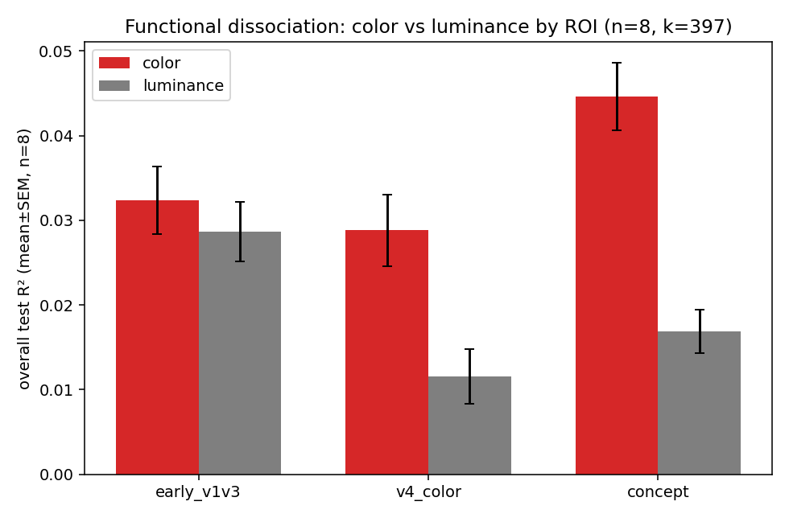

# Decoding colour and luminance from human visual cortex

*A brain-to-vision study on the Natural Scenes Dataset (NSD, 7T fMRI, n = 8).*

> **Full write-up with all figures, methods and statistics:**
> **<https://linduine.github.io/brain2vision-nsd-color/>**
> This page is a short summary; the site is the maintained version.

## The question

Which parts of visual cortex let you read out the colours a person is looking at —
and *what is that signal*? In natural images colour and object identity are deeply
correlated (skies are blue, foliage green, wood brown), so a region that represents
objects will appear to "decode colour" even without an independent chromatic code.

## What we found

**1. A double dissociation across the early → V4 → concept ladder.**
With regularization and voxel count matched (k = 397), higher visual cortex
("concept") decodes colour best, while early visual cortex (V1–V3) owns
luminance. The crossover is a genuine interaction, not two coincidental effects
(ΔΔR² = +0.024, *p* = 0.008).

**2. That colour advantage is largely object-bound.**
Residualising colour against object presence (80 COCO categories) collapses
decoding in every region — but *significantly more* in higher visual cortex
(interaction *p* = 0.008), and the ordering **reverses**: early cortex then carries
the most object-independent colour. This holds for a physical *and* a perceptual
(van de Weijer) colour target, and in **8/8 participants**.

**3. It survives the obvious alternatives.**

| Control | Result |
|---|---|
| Attention (foreground vs background) | Not foreground-specific; follows retinotopy |
| Decoder (ridge, elastic-net, linear SVM, RBF-kernel, MLP) | All agree; no nonlinear gain |
| Split-half reliability | Per-participant profiles reproduce (*r* ≈ 0.9; 8/8) |
| Signal quality (ncsnr) | Concept has the *lowest* SNR yet the *highest* decoding |
| Isoluminant colour (NSD-synthetic) | No detectable hue decoding — but low-powered, reported with that caveat |

**Conclusion.** In naturalistic viewing, the colour decodable from higher visual
cortex is largely the colour its object content predicts. This does *not* mean V4
lacks colour coding — controlled rivalry and filling-in paradigms show genuine
perceptual colour there. The claim is specific to naturalistic decoding, and it
matters for neural image reconstruction: models reading colour from higher visual
cortex may partly be reading object identity.

## Status

A preprint — *"Is colour in human visual cortex chromatic or semantic?"* — is in
preparation. Provenance of every number: [`PROVENANCE.md`](PROVENANCE.md). Code verification: [`test_analysis.py`](test_analysis.py) (26 planted-ground-truth checks). Methods notes: [`docs/methods.md`](docs/methods.md). How to run:
[`README.md`](README.md). Code is MIT-licensed; the data is **not** — see
[`DATA_TERMS.md`](DATA_TERMS.md).
