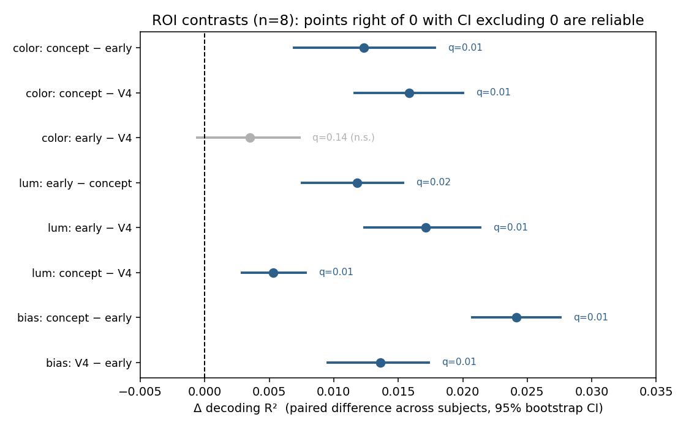
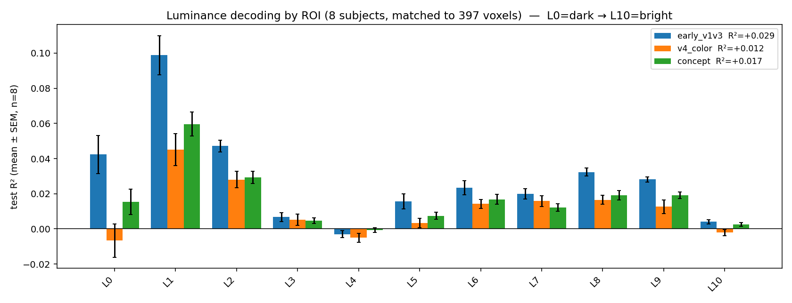

## Executive summary {#sec-summary}

Color is decodable above chance from all of visual cortex. Once the comparison
is made fair, matching regularization *and* the number of voxels across regions
 a clean, replicated functional dissociation emerges across all 8 NSD subjects
(mean ± SEM):

- **Color → higher visual cortex.** The `concept` pool (all higher visual cortex)
  decodes the image's color distribution best (R² = 0.045 ± 0.004), because color
  is bound to object and scene identity.
- **Luminance → early visual cortex.** `early_v1v3` is the only region that
  decodes brightness as well as it decodes color (luminance R² = 0.029 ± 0.004),
  and is strongest at the dark/bright extremes.
- **V4 is special at neither raw measure.** Despite its reputation as the color
  area, V4 shows no advantage for raw-pixel color, consistent with its role in
  *perceptual/constant* color rather than low-level color.

The most compact statement of the result is a single figure (@fig-dissociation):
within each region, `concept` and `v4_color` are ~2× color-biased, while
`early_v1v3` is balanced across color and luminance.

{#fig-dissociation width=70%}

::: {.callout-note}
## Update (2026): confound-controlled follow-up: a preprint is in preparation

Since this report, the study's central open question, *is higher visual cortex's color advantage chromatic or content-predictable?* (@sec-nextsteps), has been tested directly, together with a full battery of confound controls. **The headline: the color advantage of higher visual cortex is largely content-predictable.**

- **Object-identity residualization.** Removing the variance explained by object presence (80 COCO categories) collapses the higher-visual color advantage by ~86%, and the collapse holds for both a physical and a perceptual (van de Weijer) color target (all *q* = 0.008).
- **Attention control.** Color decoding is not foreground-specific; it follows retinotopy.
- **Isoluminant control.** Color without scene structure (NSD-synthetic) is not decodable.
- **Robustness.** The dissociation is decoder-agnostic (ridge, elastic-net, linear SVM, RBF-kernel, MLP: no nonlinear gain), reliable across split-halves of the data (*r* ≈ 0.9; region ordering reproduces in 8/8 participants), and conservative with respect to signal quality (the higher region has the *lowest* noise-ceiling SNR yet the highest decoding).

- **Region-specificity.** Decoding falls in every region when object identity is removed, so the critical test is the interaction: the collapse is significantly *larger* in higher visual cortex than in early cortex (physical ΔΔR² = +0.021, perceptual +0.030; both *p* = 0.008), and the ordering **reverses**: after residualization, early visual cortex carries the most content-unpredicted color.

The **double dissociation** reported below (color → higher visual, luminance → early visual; interaction ΔΔR² = +0.023, *p* = 0.008) therefore stands and is extended. A preprint, *"Is color in the human visual cortex chromatic or content-predictable? A confound-controlled decoding study of the Natural Scenes Dataset"*, is in preparation.

*Note on numbers:* the R² values below use uniform pooling across the 11 color bins. The follow-up work pools variance-weighted (so near-absent bins such as purple cannot dominate), which raises absolute values (e.g. higher-visual color R² = 0.045 → 0.066) without changing any ranking or conclusion; the dissociation interaction is +0.024 under uniform and +0.023 under variance pooling.
:::

## Motivation & hypotheses {#sec-hypotheses}

Area V4 has long been described as the brain's "color centre." The claim traces
to Zeki's single-unit recordings in macaque prestriate cortex [@zeki1973], to
human fMRI localizers that isolated a ventral-occipital color-responsive region
(hV4 / V4α) [@bartels2000], and to the clinical
syndrome of *cerebral achromatopsia*, in which circumscribed ventral-occipital
lesions abolish color perception while sparing form and motion [@zeki1990].
Later work complicates this tidy picture, color is processed across a network,
and V4's role is better described as *perceptual / constant* color than raw
wavelength [@roe2012], but "V4 = color" remains the textbook default. That
motivated two pre-specified questions, plus one control added along the way.

- **H1: Is V4 special for color?** If V4 is a color centre, it should decode
  the color content of the seen image *better than other visual ROIs*, even when
  the comparison is made fair (matched voxel count and regularization).
- **H2: Early vs. higher visual cortex for color.** Setting V4 aside, which
  carries more decodable color: early visual cortex (V1–V3), which has
  color-opponent signals from the first cortical stage, or higher-visual
  cortex, where color co-varies with object and scene identity?
- **H3: Is early visual cortex's color signal actually luminance?** (Added
  after the color results: early visual decoded *black*/*white* far better than
  any chromatic color.) If that reflects brightness sensitivity rather than
  chromatic tuning, early visual should also decode an independent *luminance*
  target best.

### What we found {#sec-hypotheses-answers}

- **H1: not supported.** V4 shows no special advantage for raw-pixel color;
  it is middling on chromatic colors and near-zero on the luminance extremes
  (@sec-color). This is consistent with V4's role in *perceptual* color, which
  raw-pixel targets do not probe.
- **H2: higher visual cortex wins**, but largely because color co-varies with
  scene/object identity, not because it is more chromatically tuned per voxel
  (@sec-color, @sec-interpretation).
- **H3: supported.** Early visual cortex decodes brightness best and is
  strongest on the dark bins (@sec-luminance), consistent with a luminance
  signature.

The rest of the report is the evidence for these answers, and the confound
removal needed to trust them.

## Dataset & baseline {#sec-dataset}

The Natural Scenes Dataset [@allen2022nsd] is a large 7T fMRI dataset in which
eight subjects each viewed ~9–10k natural images drawn from COCO [@lin2014coco]
over 30–40 scanning sessions, the standard testbed for "brain-to-vision"
decoding. We work from the preprocessed **MindEye2** release [@scotti2024mindeye2],
which provides each subject's session-wise z-scored single-trial betas flattened
to the `nsdgeneral` visual ROI (~13–16k voxels), paired with the seen images.

Within `nsdgeneral`, the release labels a clean per-subject partition of voxels,
from which we define three functional pools (@tbl-rois).

| ROI key | region | voxels (subj 1) |
|---|---|---:|
| `early_v1v3` | early visual areas V1–V3 | 3,970 |
| `v4_color` | area V4 | 687 |
| `concept` | all higher visual cortex (`higher_vis`) | 11,067 |

: The three ROIs. `early_vis` (= V1–V4) and `higher_vis` together tile
`nsdgeneral`. {#tbl-rois}

**Targets.** For each image we compute an interpretable 11-way *color* histogram
(fraction of pixels in red / orange / yellow / green / blue / purple / pink /
brown / black / white / gray) and, as an achromatic control, an 11-bin
*luminance* histogram (dark → bright, standard luma weighting). The decoder
predicts these soft distributions from voxel activity.

**Decoder & split.** Ridge regression from z-scored voxels to the target
distribution. The test set is the shared-1000 images (seen by all subjects and
held out); training uses the rest, so there is no image leakage. We report
overall and per-target R², and dominant-bin top-1 accuracy against the 1/11 ≈
0.091 chance baseline.

## Confounder removal {#sec-confounds}

Comparing ROIs of very different sizes is a trap, and the "answer" changes
completely at each step of cleaning it up. This section is the methodological
core of the study.

### ROI-specific regularization (RidgeCV) {#sec-ridge}

A single ridge `alpha` for every ROI is unfair: it over-penalizes small ROIs and
under-penalizes large ones. With a fixed `alpha`, higher visual cortex (11k
voxels) *overfit* and scored **negative** test R² (−0.37), making it look like
the worst region, which reflects under-regularization rather than the
underlying signal. Tuning `alpha` per fit with `RidgeCV` (leave-one-out CV over a
grid) addresses this; the selected `alpha` scales with ROI size (V4 ≈ 5.3k, early
≈ 15k, higher visual ≈ 43k), and the overfitting is much reduced.

### Voxel-count matching {#sec-matching}

Even when properly regularized, a bigger ROI decodes better simply from having
more voxels. To measure color information *per unit of cortex*, every ROI is
subsampled to the smallest V4 across subjects (**397 voxels**, set by subject 7 
V4 size varies by subject, from 397 to 687), decoded, and averaged over repeated
random draws (25 by default). This way, a ranking reflects
color information per voxel rather than ROI size. The exact number of draws has
little effect on the result: the draw-to-draw variability is roughly an order of
magnitude smaller than the across-subject SEM that the error bars report, so the
draws mainly stabilize each subject's point estimate.

### Trial-neighbor data hygiene {#sec-hygiene}

The alignment between betas and images is stored in per-trial `behav` records.
An early version of the reader accidentally also pulled in each trial's *neighbor*
records (`past_`/`future_`/`old_behav`), roughly 4× the data plus −1 padding 
which inflated the trial count and slightly leaked information across the
train/test split. Restricting to the current-trial record (and dropping padding)
fixed it. Ranges are now sane: ~30k trials/subject, image ids in [0, 73000).

The recovered pairing was then validated by falsification, a label-permutation
test, the [`alignment_check`](https://github.com/linduine/brain2vision-nsd-color/blob/main/brain2vision/alignment_check.py)
module: with the true alignment, V4 decodes color at R² = 0.045,
versus R² ≈ 0 (−0.0003 ± 0.0001 over 20 shuffles) when the image labels are
permuted. The true value sits hundreds of SDs above the shuffled null, confirming
the betas↔image mapping end-to-end, a scrambled pairing would have collapsed to
zero. (This checks the *pairing*, not decoding accuracy: the modest R² itself is
expected from noisy single-trial fMRI and a small ROI.)

### Replication {#sec-replication}

The matched analysis was run first on the four subjects with all 40 sessions
(1, 2, 5, 7), then extended to all eight (adding the reduced-session subjects
3, 4, 6, 8), summarizing as mean ± SEM. The pattern held; the added subjects
lowered the absolute R² a little and tightened the error bars.

### Statistical inference {#sec-stats}

The mean ± SEM values reported above indicate which ROI differences are likely to
be reliable, but non-overlap of standard-error bars is not itself a statistical
test. We therefore assessed the ROI contrasts inferentially, with particular
attention to whether the color/luminance ordering constitutes a genuine
region-by-domain interaction rather than two independently directed main effects.

Because every subject contributes to all ROIs, contrasts were computed
within-subject and evaluated with an exact paired sign-flip permutation test,
which requires no distributional assumptions and is appropriate for a small
sample. Effect sizes are reported as 95% bootstrap confidence intervals, and
p-values are corrected for multiple comparisons across the family of contrasts
using the Benjamini-Hochberg procedure (implementation:
[`stats`](https://github.com/linduine/brain2vision-nsd-color/blob/main/brain2vision/stats.py)).
Note that at n = 8 the two-sided permutation *p* is bounded below by 2/2⁸ ≈ 0.008;
a value of 0.008 therefore indicates that the observed difference exceeds all
alternative sign assignments, the maximal evidence attainable at this sample
size, rather than a marginal result.

The full set of contrasts is reported in @tbl-stats and @fig-stats. All ROI
comparisons remain significant after FDR correction, with the single exception of
early visual versus V4 for color, which is statistically indistinguishable. The
interaction of primary interest, higher visual cortex being more color-biased
than early visual cortex, is the largest and most reliable effect in the set.

| contrast | Δ R² | *p* | *q* (FDR) | 95% CI |
|---|---:|---:|---:|:---:|
| color: higher − early | +0.012 | 0.008 | 0.01 | [0.007, 0.018] |
| color: higher − V4 | +0.016 | 0.008 | 0.01 | [0.012, 0.020] |
| color: early − V4 | +0.004 | 0.141 | 0.14 | [−0.001, 0.007] |
| luminance: early − higher | +0.012 | 0.016 | 0.02 | [0.008, 0.015] |
| luminance: early − V4 | +0.017 | 0.008 | 0.01 | [0.012, 0.021] |
| luminance: higher − V4 | +0.005 | 0.008 | 0.01 | [0.003, 0.008] |
| **bias: higher − early** | **+0.024** | **0.008** | **0.01** | **[0.021, 0.028]** |
| bias: V4 − early | +0.014 | 0.008 | 0.01 | [0.010, 0.017] |

: Across-subject ROI contrasts (n = 8): mean paired difference in decoding R²,
exact sign-flip permutation *p*, FDR-corrected *q*, and 95% bootstrap CI. "bias" =
color R² − luminance R² (the dissociation interaction). {#tbl-stats}

{#fig-stats width=85%}

## Results & interpretation {#sec-results}

### Color: higher visual cortex wins {#sec-color}

Across all 8 subjects, with size and regularization controlled, higher visual
cortex decodes color best (@tbl-color, @fig-color): higher visual cortex beats early visual
(Δ = 0.012; paired sign-flip permutation *p* = 0.008, FDR *q* = 0.01; 95% CI
[0.007, 0.018]) and V4 (Δ = 0.016, *q* = 0.01). Early visual and V4 are
statistically tied on color (Δ = 0.004, *q* = 0.14).

| ROI | overall R² | top-1 |
|---|---:|---:|
| `concept` (higher visual) | **0.045 ± 0.004** | 0.239 ± 0.004 |
| `early_v1v3` | 0.032 ± 0.004 | 0.246 ± 0.004 |
| `v4_color` | 0.029 ± 0.004 | 0.234 ± 0.004 |

: Color decoding, all 8 subjects, matched to 397 voxels. Chance top-1 ≈ 0.091. {#tbl-color}

{#fig-color}

Breaking it down by color: higher visual cortex leads on
the chromatic, content-predictable colors (brown 0.13, blue 0.10, orange 0.07, green
0.06). Early visual cortex is the standout for **black** (0.080 vs V4's 0.002 
essentially zero) and leads on white too, the luminance extremes. Rare colors
(purple, pink) are unreliable everywhere, having too few training examples; their
negative R² is a scarcity artifact.

### Luminance: early visual cortex wins {#sec-luminance}

For brightness the ordering **flips** (@tbl-luminance, @fig-luminance): early
visual leads and V4 drops to last. At n = 8 early's lead over higher visual is
significant (Δ = 0.012; *p* = 0.016, *q* = 0.018; 95% CI [0.008, 0.015], it was
only marginal at n = 4), and early beats V4 more strongly (Δ = 0.017, *q* = 0.01).
The **dissociation itself** is significant: higher visual cortex is more
color-biased than early visual, the color-minus-luminance R² differs by
Δ = 0.024 (*p* = 0.008, *q* = 0.01; 95% CI [0.021, 0.028]), which is what makes
the crossover a real double dissociation rather than two coincidental effects.

| ROI | overall luminance R² |
|---|---:|
| `early_v1v3` | **0.029 ± 0.004** |
| `concept` | 0.017 ± 0.003 |
| `v4_color` | 0.012 ± 0.003 |

: Luminance decoding, all 8 subjects, matched to 397 voxels. {#tbl-luminance}

{#fig-luminance}

### Interpretation {#sec-interpretation}

The pattern maps cleanly onto known visual neuroscience:

- **Early visual cortex (V1–V3)** represents low-level, retinotopic image
  properties, luminance and local chromatic contrast, and decodes brightness
  and color about equally. Its edge in the dark/black regime is a luminance
  signature.
- **Higher visual cortex** decodes color best not because it is chromatically
  tuned *per se*, but because color correlates with *what's in the scene* (sky is
  blue, foliage green, indoor scenes brown/gray), which it encodes. It is
  strongly biased toward chromatic over luminance information.
- **V4** is chromatically biased (color > luminance, like higher visual) but weak
  on raw pixel statistics. A plausible reading is that this reflects V4's role in
  *color constancy*, recovering a stable surface color as the illuminant changes.
  V4 lesions impair color constancy while leaving wavelength discrimination intact
  [@wild1985], so V4 is thought to represent color after an illuminant-discounting
  transform, not the raw wavelength hitting the retina. Our targets are histograms
  of the stimulus's *raw pixels*, and because NSD images are shown under fixed
  display conditions there is no illuminant variation to discount, so the target
  is, by construction, the physical-wavelength signal. A region that encodes that
  physical signal directly (early visual) predicts the target well; a region whose
  representation is a nonlinear, constancy-adjusted transform of it (V4) is
  encoding something only partially correlated with raw pixels, so a raw-pixel
  decoder under-reads its contribution. In short, this design cannot dissociate
  perceived from physical color, which is exactly where V4's putative advantage
  would live, so the modest V4 result is uninformative about that advantage
  rather than evidence against it.

### Caveats {#sec-caveats}

This is a correlational decoding result, "decodable from region X" is not
"represented or used by X." The targets are raw-pixel color/luminance histograms,
which do not capture perceptual color (constancy, categories), likely where V4
would shine. Effects replicate across all 8 subjects but this is one dataset with
one preprocessing pipeline, and effect sizes are modest (R² ≈ 0.01–0.04). The
`concept` pool is coarse: `higher_vis` lumps all higher visual cortex and does
not separate face/place/body/word regions, so "higher visual cortex decodes
color best" is a claim about a broad pool, not about any specific
category-selective area.

## Next steps {#sec-nextsteps}

This study establishes the ROI-level dissociation; several follow-ups would
sharpen it, and the repository *begins* the groundwork for them.

- **Is higher visual cortex's color advantage chromatic or content-predictable?** Color
  co-varies with which objects are present, which higher visual cortex encodes, so
  its color lead may ride on that content. `semantic_targets` builds a
  color-free content feature (COCO object-category presence, not
  CLIP image features, which leak color), and `semantic_residual` removes the
  content-explained part of color cross-validated, leaving residual (chromatic)
  color to re-decode per ROI. If higher visual still leads on residual color the
  advantage is chromatic; if it collapses, it was content-predictable. **Update: now run (see the callout at the top).** Residualizing color against COCO object presence collapses the higher-visual advantage by ~86% (*q* = 0.008, for both physical and perceptual color targets), indicating the advantage is largely content-predictable rather than chromatic.

- **Split the `concept` pool into category-selective regions.** The natural next
  question is *which* higher-visual region drives the color advantage, e.g.
  whether scene-selective cortex (PPA) carries the scene-color signal. This
  requires the finer raw-NSD ROI masks (FFA, PPA, EBA, VWFA, …). The
  accompanying repository *starts* this path, a `raw_nsd` module extracts those
  sub-regions from the raw volumetric betas, but the decoding analysis over them
  is not yet done.
- **Probe perceptual color, not just pixel color.** Targets that capture color
  *categories* or color constancy (rather than raw-pixel HSV rules) would better
  reflect how people name color, the current rules dump a washed-out sky into
  white/grey rather than blue. A first step is scaffolded: `perceptual_color_targets`
  builds the target from the van de Weijer learned color-name model, so pale
  sky-blue keeps real "blue" mass. The decoding over it is not yet run. Full
  color *constancy* (discounting the illuminant) would go further still, and is
  what would actually test V4's specialty.
- **Extend toward reconstruction.** Pairing the ROI betas with CLIP embedding
  targets (a `clip_targets` module is included), and adding a VAE-latent target
  for the low-level pathway, would move from "what is decodable" toward "what can
  be reconstructed."

## Reproducibility {#sec-reproduce}

The full pipeline is packaged as the `brain2vision` Python package. By
downloading the data you accept the NSD and COCO terms; nothing here redistributes
the data.

```bash
# environment
pip install -e ".[color]"

# data (accepts NSD/COCO terms); ~1.5 GB/subject + ~22 GB images
python download_data.py --subjects 1 2 3 4 5 6 7 8 --images

# targets
python -m brain2vision.color_targets     --images data/coco_images_224_float16.hdf5 --out data/color_targets.npy
python -m brain2vision.luminance_targets  --images data/coco_images_224_float16.hdf5 --out data/luminance_targets.npy

# the matched, replicated comparison: color, then luminance
python -m brain2vision.replicate_subjects --subjects 1 2 3 4 5 6 7 8 \
    --target data/color_targets.npy --out roi_color_8subj.png
python -m brain2vision.replicate_subjects --subjects 1 2 3 4 5 6 7 8 \
    --target data/luminance_targets.npy \
    --labels L0,L1,L2,L3,L4,L5,L6,L7,L8,L9,L10 --out roi_luminance_8subj.png
```

Full method notes and module reference are in
[`docs/methods.md`](https://github.com/linduine/brain2vision-nsd-color/blob/main/docs/methods.md).

## Data & credit {#sec-credit}

Code is MIT-licensed; the data is **not**, NSD and COCO carry their own terms
(see `DATA_TERMS.md` in the repository). Please cite the Natural Scenes Dataset
[@allen2022nsd], COCO [@lin2014coco], and MindEye2 [@scotti2024mindeye2].

## References {.unnumbered}

::: {#refs}
:::
